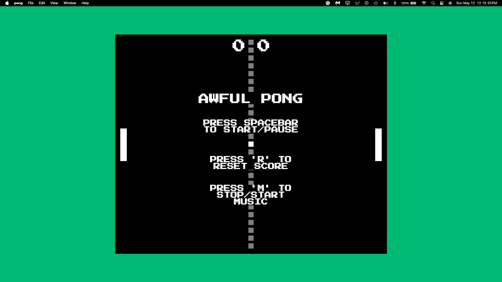

##  Hi, this is my first app built using Electron and NodeJS:
# Awful Pong. 👍



*that's it, it's just pong, and it's awful.*

This is a simple implementation of the classic Pong game built with Electron. This project serves as my first step into building desktop applications. It was perfect for learning the ropes of Electron app development and understanding the basics of game development using JavaScript.

Check Releases if you wanna play for yourself, and if you *actually* want to expand on this hunk of garbage:

---
## Prerequisites

Before you begin, ensure you have the following installed on your system:
- [Node.js](https://nodejs.org/) (which comes with [npm](http://npmjs.com/))
- [Git](https://git-scm.com/)

---

## Getting Started

To get a local copy up and running follow these simple steps.

### Installation

1. Clone the repo
   ```sh
   git clone https://github.com/royflowers99/awful-pong.git
   ```
2. Navigate to the project directory
    ```sh
    cd awful-pong
    ```
3. Install npm packages
    ```sh
    npm install
    ```

### Usage

To start, run `npm start`

---

## Build

- macOS
    ```sh
    npm run build-mac
    ```

- Windows
    ```sh
    npm run build-win
    ```

---

## Contact & Contributing

Don't 👍

## License

Distributed under the ISC License.